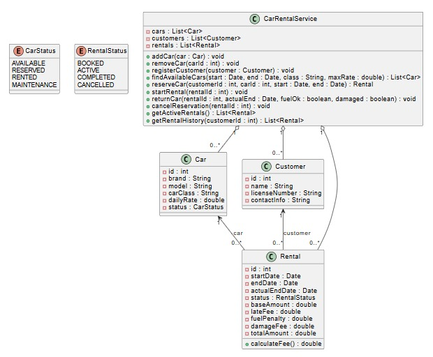

# Car Rental System (Система проката автомобилей)

## Описание проекта
Данный проект реализует модульную систему проката автомобилей на Python, включая управление автопарком, клиентами, бронированием, арендой и возвратом автомобилей. Данные хранятся в JSON-файле, который выступает в роли простой файловой базы данных.

## Стек технологий
- Python 3.8+
- Dataclasses
- Enum
- Typing
- JSON

## Структура проекта
```
car_booking/
│
├── models.py           # модели данных (Car, Customer, Rental)
├── service.py          # бизнес-логика системы
├── json_db.py          # работа с JSON-базой данных
├── main_demo.py        # демонстрационный сценарий
└── db.json             # файловая база данных
```

## Краткое описание модулей

### models.py
Содержит:
- `Car` — автомобиль (id, марка, модель, класс, цена, статус)
- `Customer` — клиент (id, имя, номер прав, контакты)
- `Rental` — аренда (клиент, авто, даты, статус, штрафы, итоговая сумма)
- `calculate_fee()` — расчет стоимости аренды

### service.py
Бизнес-логика:
- добавление и удаление автомобилей;
- регистрация клиентов;
- поиск доступных авто;
- бронирование и отмена бронирования;
- начало аренды (start_rental);
- возврат автомобиля (return_car) с расчётом стоимости;
- получение активных и исторических аренд.

### json_db.py
Функции:
- `load_database()` — загрузка db.json
- `save_database()` — сохранение db.json

### main_demo.py
Пример использования системы:
1. Добавление авто
2. Регистрация клиента
3. Бронирование
4. Начало аренды
5. Возврат авто
6. Печать итоговой суммы

## Пример рабочего сценария
```
service = CarRentalService()

car = service.add_car("Toyota", "Corolla", "economy", 40.0)
customer = service.register_customer("Егор Брезговин", "AB1234567", "+7 900 111-22-33")

rental = service.reserve_car(customer.id, car.id, date(2025, 1, 10), date(2025, 1, 15))
service.start_rental(rental.id)

total = service.return_car(rental.id, date(2025, 1, 15))
print("Итоговая сумма:", total)
```

## Хранение данных
База данных хранится в файле:
```
db.json
```
Содержит:
- список автомобилей,
- список клиентов,
- список аренд (со ссылками по ID).

## Установка и запуск
1. Установите Python 3.8+
2. Скачайте файлы проекта
3. Запустите демо:
```
python main_demo.py
```

## UML-диаграмма
